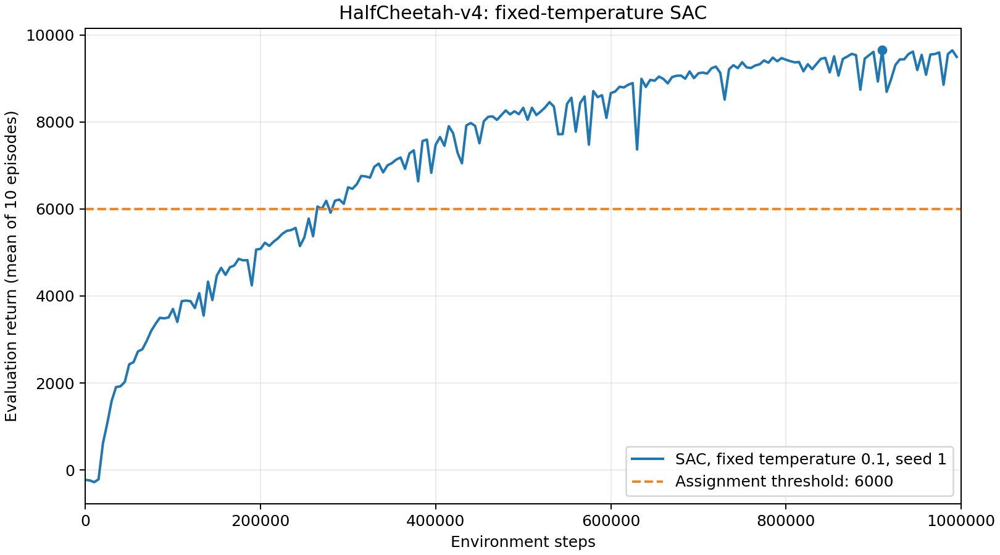

# Section 3.4: HalfCheetah fixed-temperature SAC

使用默认配置、固定温度 0.1、单个 Critic 和训练 seed 1，完成 1,000,000 个环境步。每隔 5,000 步评估 10 个回合，并记录平均回报。

平均评估回报在 265,000 步首次达到 6056.76，超过作业要求的 6000；在 910,000 步达到最高值 9664.60。最后一次评估位于 995,000 步，平均回报为 9499.07。最后 10 次评估（950,000–995,000 步）的平均回报为 9412.11，范围为 8857.90–9649.83，均高于 6000。

曲线展示原始平均评估回报，未做平滑，横轴为环境步数。已记录的主要训练指标及最终模型参数均未出现 NaN/Inf；Q 值与目标值接近只能作为数值检查，不能单独证明价值估计准确。

本实验仅使用一个训练 seed，不能据此判断不同 seed 下的表现。最后一次评估在 995,000 步，最终 1,000,000 步 checkpoint 未另行评估。本轮保留为 Section 3.5 自动温度实验的固定温度基线。

