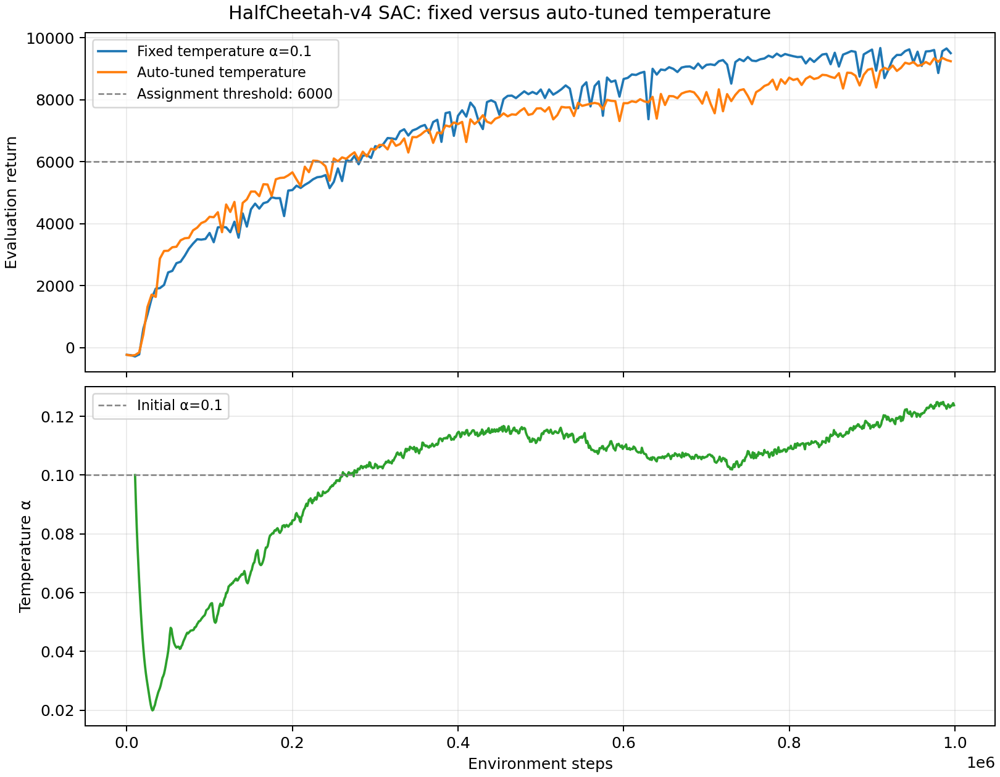

# HalfCheetah temperature comparison

固定温度基线和自动温度实验都使用 seed 1、1,000,000 个环境步和每次 10 个评估回合。自动温度版本首次在 225,000 步超过 6000，固定温度版本在 265,000 步超过 6000。固定温度版本峰值为 9664.60，自动温度版本峰值为 9346.23；最后 10 次评估的平均回报分别为 9412.11 和 9219.50。

自动温度从 0.1 开始，在 31,000 步附近降至 0.01997，随后逐步升高，最后稳定在约 0.124。该变化说明训练早期策略需要较强的熵调节，后期为了维持目标熵，温度提高。自动温度版本的最后阶段仍保持高回报，但本次单 seed 结果没有超过已经调好的固定温度基线。

