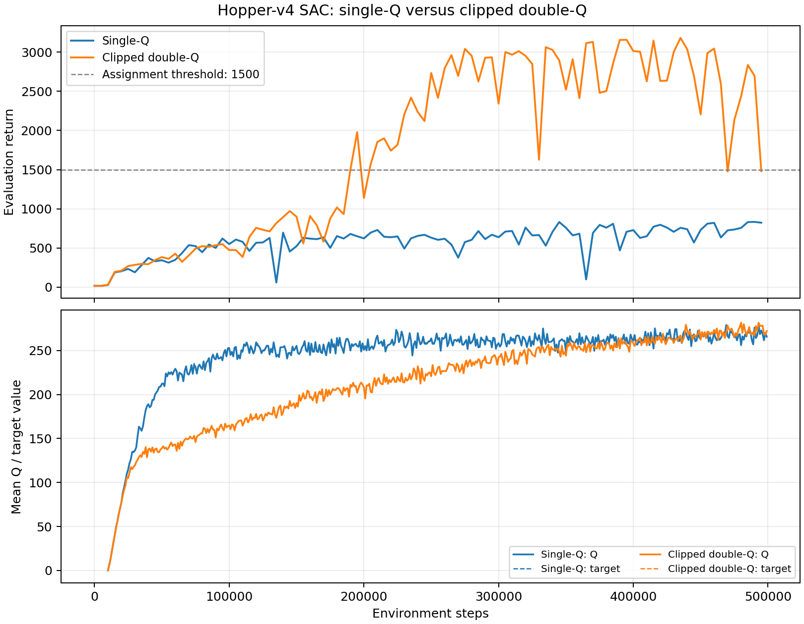

# Hopper clipped double-Q comparison

single-Q never reaches an average evaluation return of 1500; its peak is 833.40. Clipped double-Q first exceeds 1500 at 190,000 steps and reaches a peak of 3180.66 at 435,000 steps. Its last ten evaluation returns average 2388.97, while single-Q averages 770.29.

The clipped double-Q curve is substantially better in this seed. The lower target estimate reduces the chance that one overestimated target critic drives both critics toward an optimistic Bellman target. Q values should be interpreted together with the policy and visited state distribution; a larger raw Q value alone does not prove better performance.

