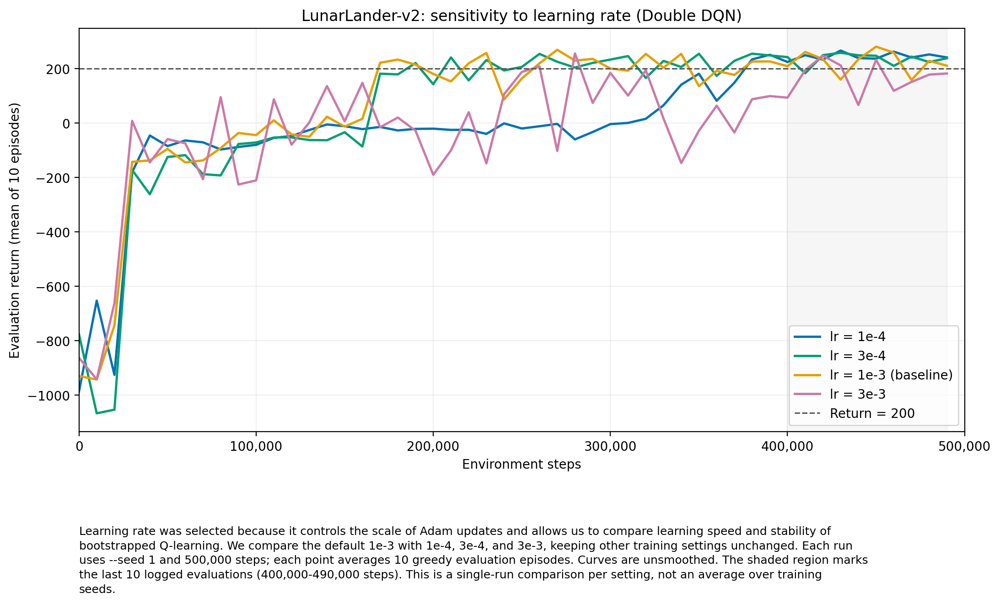

本实验完成 HW3 第 2.6 节要求：选择学习率作为超参数，将原始基线 1e-3 与另外三个取值 1e-4、3e-4、3e-3 在同一张图上比较。四次实验均完成 500,000 步，保存了最终检查点，记录的损失、Q 值和梯度范数均未出现 NaN 或无穷大。

图注：选择学习率，是因为它直接控制 Adam 参数更新的整体幅度，适合研究 Q-learning 学习速度与稳定性的关系。比较 1e-4、3e-4、默认值 1e-3 和 3e-3，其余训练设置一致；实验名称仅用于区分日志。每次训练使用 --seed 1，训练 500,000 个环境步，每隔 10,000 步评估 10 个回合，评估采用 ε=0 的贪心策略。横轴为环境步数，纵轴为评估平均回报；曲线未经平滑，浅灰区域为用于后期统计的最后 10 次评估。

| 学习率 | 首次评估均值 ≥200 的步数 | 最高评估均值 | 最后一次评估 | 后期均值 | 后期波动标准差 | 后期达标次数 |
|---|---:|---:|---:|---:|---:|---:|
| 1e-4 | 380,000 | 266.15 | 240.71 | 244.22 | 12.43 | 10/10 |
| 3e-4 | 190,000 | 257.92 | 238.02 | 234.30 | 21.67 | 9/10 |
| 1e-3 | 170,000 | 280.34 | 210.36 | 223.32 | 38.65 | 8/10 |
| 3e-3 | 260,000 | 255.37 | 181.76 | 167.19 | 56.59 | 3/10 |

统计口径：后期指第 400,000 至 490,000 步的 10 次评估。后期均值是这 10 个评估均值的平均数；后期波动标准差是这 10 个评估均值之间的总体标准差，不是单次评估的回合间标准差，也不是多训练种子之间的标准差。每次评估包含 10 个回合。最后一次评估位于 490,000 步；本文没有另行评估训练到 500,000 步时保存的最终 agent.pt。

1e-4 首次达到 200 分需要 380,000 步，学习最慢，但后期均值最高（244.22），波动最小（12.43），最后 10 次评估均超过 200，体现出较好的后期稳定性。

3e-4 在 190,000 步首次达标，明显早于 1e-4；其后期均值为 234.30，波动为 21.67，最后 10 次评估有 9 次达标。在本次实验中，它在学习速度和后期稳定性之间取得了较好的平衡。

默认 1e-3 在 170,000 步最早达标，并获得最高的峰值回报 280.34；但后期均值为 223.32、波动为 38.65，后期稳定性弱于两个较小学习率。峰值最好不等于后期平均表现最好。

3e-3 在 260,000 步首次达标，比默认值更晚；后期均值最低（167.19），波动最大（56.59），最后 10 次评估只有 3 次达标。这与较大学习率可能造成更新过大、学习不稳定的解释一致，但单次运行不能证明波动完全由学习率引起。

本次结果表明：降低学习率到 1e-4 有利于后期表现，但付出了更多环境交互步数；1e-3 学习最快且峰值最高；3e-4 提供了较好的速度与稳定性折中；增大到 3e-3 没有带来更快达标，反而表现更不稳定。

限制：每个设置只有一次训练，以上结论限于这些观测结果，不能视为跨随机种子的统计结论。当前脚本设置了 NumPy 和 PyTorch 的随机种子，但未显式设置 Gym 环境种子，因此相同 --seed 并不保证不同实验的环境随机过程完全一致。

数据来源（均位于 hw3/exp/）：

- `1e-4`：`LunarLander-v2_dqn_lr_1e-4_sd1_20260922_111712/log.csv`
- `3e-4`：`LunarLander-v2_dqn_lr_3e-4_sd1_20260922_111712/log.csv`
- `1e-3`：`LunarLander-v2_dqn_sd1_20260921_214108/log.csv`
- `3e-3`：`LunarLander-v2_dqn_lr_3e-3_sd1_20260922_111712/log.csv`
